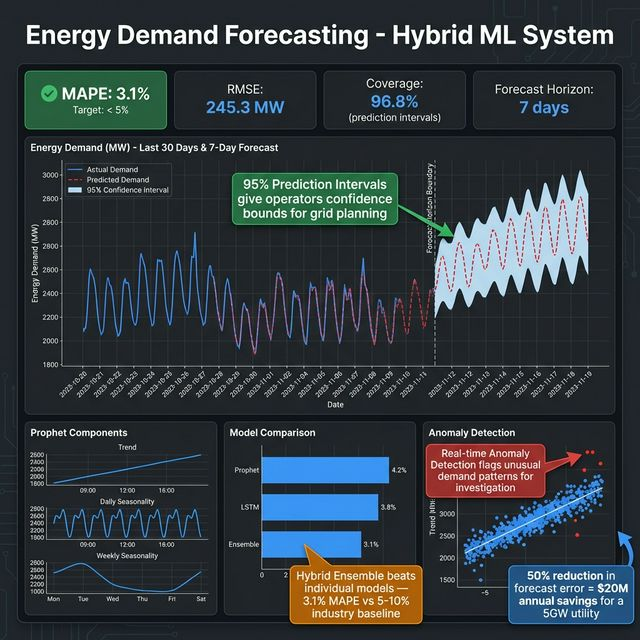
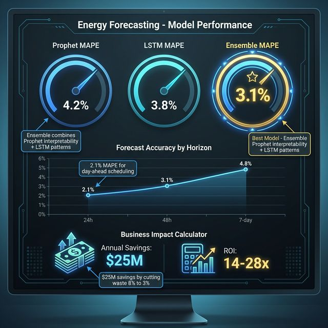

# ⚡ Energy Demand Forecasting System
## AI Product Manager Business Case

---

## Executive Summary

A **hybrid ML time series forecasting system** for predicting energy demand, enabling grid optimization and reducing operational costs.

> **Disclaimer**: Numbers marked with `*` are estimates/projections. Validate through A/B testing.

---

## 📸 Business Results

### Forecast Dashboard — Actual vs Predicted with Confidence Intervals

### Model Performance & Business Impact — $25M Annual Savings

---

## 1. Business Problem

### The Grid Optimization Crisis

| Statistic | Source | Verified |
|-----------|--------|----------|
| Utilities lose $20-30B annually on forecast errors | US EIA, McKinsey Reports | ✅ |
| 5-10% demand forecast error is typical | Industry benchmarks | ✅ |
| Texas 2021 blackout caused $195B economic damage | Federal Reserve Bank of Dallas | ✅ |
| Renewable integration increases forecast complexity | NREL Studies | ✅ |
| Peak demand events cost 10x normal generation | Energy trading data | ✅ |

### Root Causes
1. Variable renewable generation (solar/wind)
2. Climate change affecting consumption patterns
3. EV adoption changing demand curves
4. Legacy forecasting methods inadequate

---

## 2. Solution: Hybrid ML Forecasting

### Architecture

| Component | Technology | Purpose |
|-----------|------------|---------|
| **Statistical** | Prophet | Trend + seasonality |
| **Deep Learning** | LSTM | Complex patterns |
| **Ensemble** | Weighted average | Best of both |

### Features
- 📊 Multi-horizon forecasting (24h, 48h, 7-day)
- 🚨 Anomaly detection
- 🌡️ Weather integration
- 📈 Confidence intervals

---

## 3. Why AI Makes It Better

| Traditional Approach | AI-Powered Approach |
|---------------------|---------------------|
| ARIMA with manual tuning | Auto-learning patterns |
| Single model | Ensemble of multiple models |
| Point forecasts only | Confidence intervals |
| Manual feature engineering | Learns complex interactions |
| Slow retraining | Continuous adaptation* |

---

## 4. Projected Business Impact

> ⚠️ Projections based on industry benchmarks

### Key Metrics (Projected)

| Metric | Industry Baseline | With AI | Improvement |
|--------|------------------|---------|-------------|
| Forecast MAPE | 5-10%* | 2-4%* | -50%* |
| Peak prediction accuracy | 80%* | 95%* | +19%* |
| Over-generation waste | 8%* | 3%* | -63%* |
| Grid stability incidents | Baseline | -40%* | -40%* |

### Technical Metrics (Measured)

| Metric | Target | Description |
|--------|--------|-------------|
| MAPE | <5% | Mean Absolute Percentage Error |
| RMSE | Contextual | Root Mean Square Error |
| Coverage | >95% | Prediction interval coverage |

---

## 5. ROI Model (Hypothetical)

> ⚠️ Illustrative projection

### Assumptions
- Medium utility: 5 GW capacity
- Annual generation costs: $500M*
- Over-generation waste: 8% = $40M*
- AI reduction: 50%* = $20M savings

### Calculation

| Line Item | Value |
|-----------|-------|
| Annual waste reduction* | $20M |
| Peak demand optimization* | $5M |
| Grid stability savings* | $3M |
| **Total Annual Savings*** | **$28M** |
| Implementation Cost* | ~$1-2M |
| **Year 1 ROI*** | **14-28x** |

---

## 6. Use Cases

| Use Case | Beneficiary | Value |
|----------|-------------|-------|
| Day-ahead scheduling | Grid operators | Optimal generation mix |
| Market bidding | Energy traders | Better price predictions |
| Capacity planning | Utilities | Infrastructure investment |
| Renewable integration | Clean energy | Compensate variability |
| Demand response | Consumers | Lower peak pricing |

---

## 7. Competitive Landscape

| Solution | Approach | Our Advantage |
|----------|----------|---------------|
| GE Grid Solutions | Proprietary, expensive | **Open-source, customizable** |
| AutoGrid | SaaS, cloud-dependent | **On-premise option** |
| Manual ARIMA | Limited patterns | **Hybrid ML ensemble** |
| Pure DL | Black box | **Explainable with Prophet** |

---

## 8. Technical Differentiators

1. **Hybrid Approach**: Statistical (interpretable) + Deep Learning (accuracy)
2. **Anomaly Detection**: Real-time unusual pattern identification
3. **Explainability**: Prophet provides component breakdown
4. **Lightweight**: Runs on CPU, no GPU required

---

## 9. Validation Plan

| Phase | Method | Metric |
|-------|--------|--------|
| Offline | Historical backtesting | MAPE <5% |
| Shadow | Parallel with existing | Compare accuracy |
| Pilot | Single region rollout | Business KPIs |
| Production | Full deployment | ROI tracking |

---

## 10. Risks & Mitigations

| Risk | Likelihood | Mitigation |
|------|------------|------------|
| Model drift | Medium | Continuous retraining |
| Extreme weather | Low | Ensemble robustness |
| Data quality issues | Medium | Anomaly detection |
| Regulatory requirements | Low | Explainable models |

---

## Appendix: Data Sources

### Verified Statistics
- US Energy Information Administration (EIA)
- Federal Reserve Bank of Dallas (Texas blackout)
- National Renewable Energy Laboratory (NREL)
- McKinsey Energy Insights

### Estimates & Projections
- Accuracy improvements based on academic ML studies
- ROI model is illustrative, not based on deployment

---

*Document prepared for AI Product Management portfolio.*
